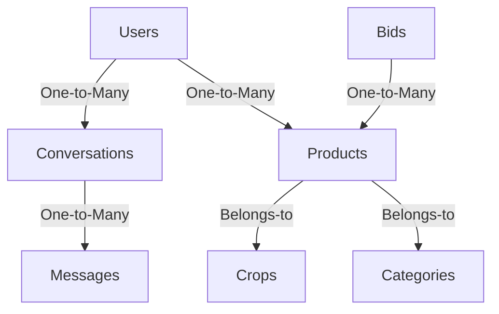

# 🌾 FarmConnect

  
*Empowering Farmers, Enriching Lives*  

FarmConnect is a mobile application designed to create a seamless online marketplace for farmers to sell their produce directly to buyers. The app aims to revolutionize agricultural trade by eliminating middlemen, promoting fair trade practices, and fostering direct communication between farmers and buyers.

---

## 📱 Screenshots

### Farmer Features
  
  

### Buyer Features
  
  

---

## ✨ Features

### 👨‍🌾 **Farmer Features**
- **Login/Signup**: Secure authentication for farmers.
- **Post a Product**: Add details of crops or produce, including price and quantity.
- **Incoming Requests**: View and manage requests from buyers.
- **Chat with Buyers**: Real-time chat to negotiate and finalize deals.
- **Profile Update**: Manage and update personal information.

### 🛒 **Buyer Features**
- **Login/Signup**: Secure authentication for buyers.
- **Browse Products**: View all available products with advanced filtering options.
- **Apply Bid**: Submit bids for desired products.
- **View Applied Bids**: Keep track of bids submitted.
- **Chat with Farmers**: Real-time chat for better deal-making.
- **Profile Update**: Manage and update personal information.

### 🚀 **Other Features**
- **Real-Time Updates**: Chat functionality powered by Supabase real-time database.
- **Secure Payments**: Placeholder for integrating payment gateways.

---

## 🛠️ Technology Stack

| **Technology** | **Purpose** |
|-----------------|-------------|
| **TypeScript**  | Strongly-typed development |
| **React Native**| Cross-platform mobile app development |
| **Expo**        | Fast prototyping and deployment |
| **Supabase**    | Backend as a Service (BaaS) with real-time capabilities |
| **PostgreSQL**  | Relational database for structured data |

---

## 🗃️ Database Schema

FarmConnect's database schema is designed to handle farmer and buyer interactions efficiently.



### **Tables Overview**
- **Users**: Stores details of farmers and buyers.
- **Products**: Details about the crops/products being sold.
- **Crops**: Master table for crop categories.
- **Categories**: Subcategories for produce.
- **Bids**: Buyer bids on products.
- **Conversations**: Stores chat sessions.
- **Messages**: Handles individual chat messages.

---

## 📥 Installation and Setup

Follow these steps to set up the project locally:

### Prerequisites
- Node.js (v16 or later)
- Expo CLI
- Supabase account with database setup

### Steps
1. **Clone the Repository**
   ```bash
   git clone https://github.com/your-username/FarmConnect.git
   cd FarmConnect
   ```

2. **Install Dependencies**
   ```bash
   npm install
   ```

3. **Set Up Environment Variables**
   - Create a `.env` file in the root directory.
   - Add the following variables:
     ```env
     SUPABASE_URL=your_supabase_url
     SUPABASE_ANON_KEY=your_supabase_anon_key
     ```

4. **Run the Development Server**
   ```bash
   npm start
   ```

5. **Open the App**
   - Scan the QR code with the **Expo Go** app on your phone.

---

## 🚧 Future Enhancements
- **Payment Gateway Integration**: Secure online payments for transactions.
- **Analytics Dashboard**: Insights for both farmers and buyers.
- **Multi-Language Support**: Expand accessibility to regional users.
- **Crop Price Prediction**: Use AI to predict optimal prices.

---

## 👨‍💻 Author
- **Name**: [Govind Kulkarni]
- **Email**: [kulkarnigovind2003@gmail.com]
- **LinkedIn**: [Your LinkedIn Profile](https://www.linkedin.com/in/govind-kulkarni-44aa71228/)

---

## 🤝 Contributing
Contributions, issues, and feature requests are welcome!  
Feel free to check the [issues page](https://github.com/govindKulk/farmconnect-expo-rn/issues).

---

